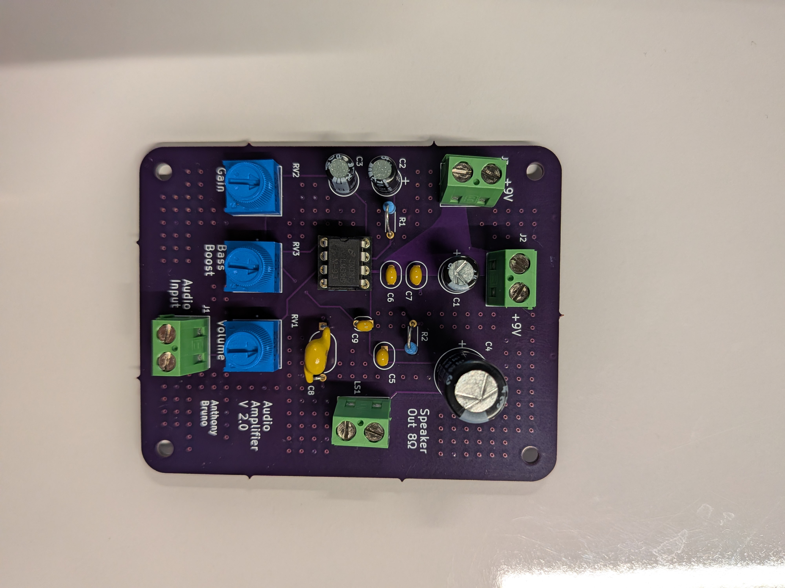
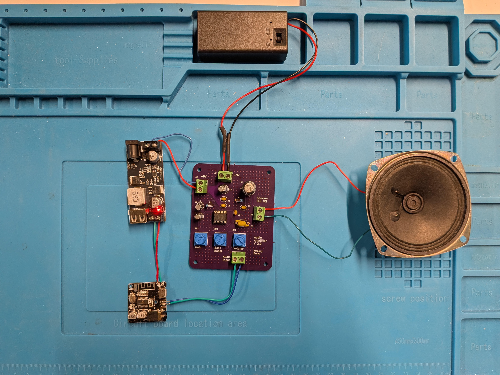

# AudioAmpV2
This repo contains information, design files, and documentation on the Audio Amplifier PCB I designed. This is version 2 of the original design built in 2018.

Notes:
* CAD Software: KiCAD Version 9.0
* PCB Manufacturer: https://oshpark.com/
* Recommend getting a 6-pin Socket for the LM386 Audio Amplifier for easier replacement
* Resistor soldering can need to be vertically soldered (Recommend searching what this looks like since the resistors used in my design don't fit the footprints exactly)
* Buck Converter (19V - 12V to 5V - 5.3V): https://www.amazon.com/dp/B0D141CZMZ?ref=ppx_yo2ov_dt_b_fed_asin_title&th=1
* 9V Battery: https://www.amazon.com/dp/B0774D64LT?ref=ppx_yo2ov_dt_b_fed_asin_title
* Battery Connector and holder: https://www.amazon.com/dp/B07BXBS93X?ref=ppx_yo2ov_dt_b_fed_asin_title
* 8-Ohm Speaker: https://www.amazon.com/dp/B00XW2NPTG?ref=ppx_yo2ov_dt_b_fed_asin_title
* Bluetooth Receiver: https://www.amazon.com/dp/B08D94PGCG?ref=ppx_yo2ov_dt_b_fed_asin_title

